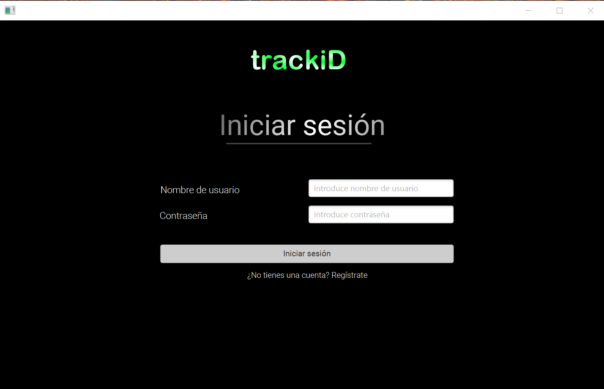
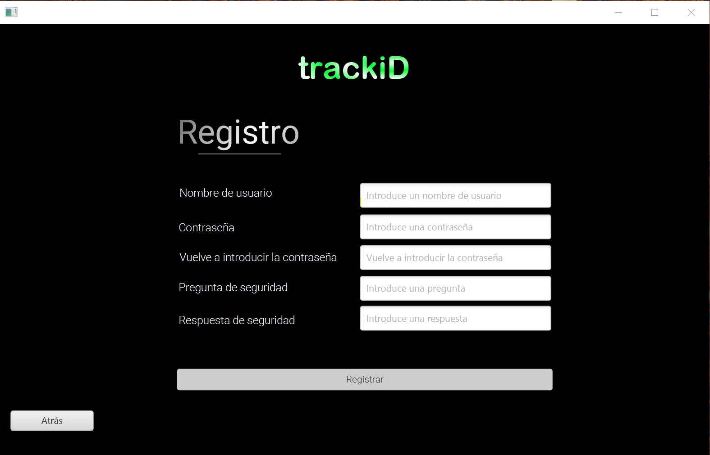
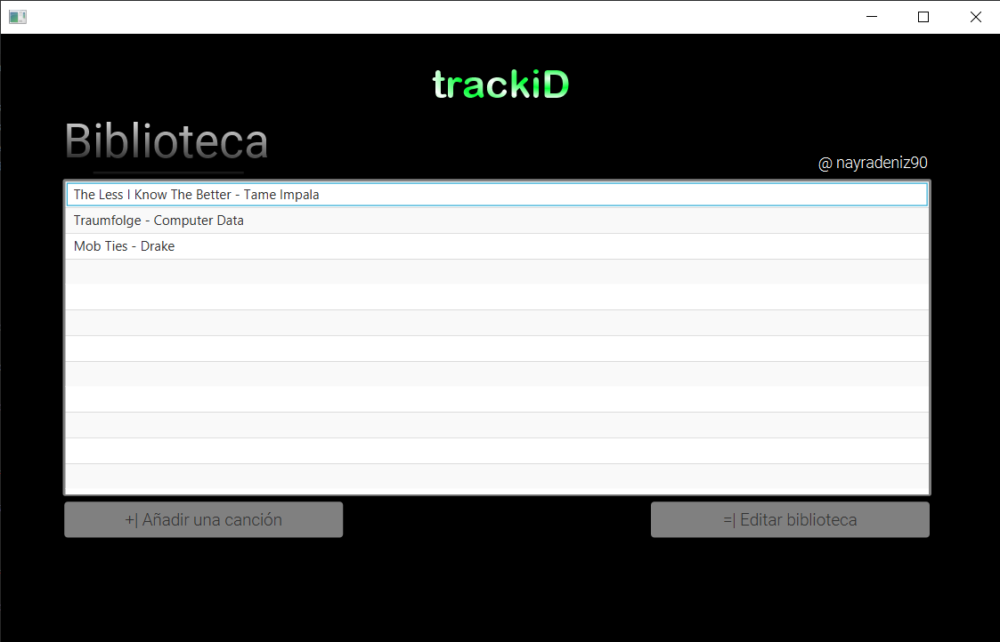
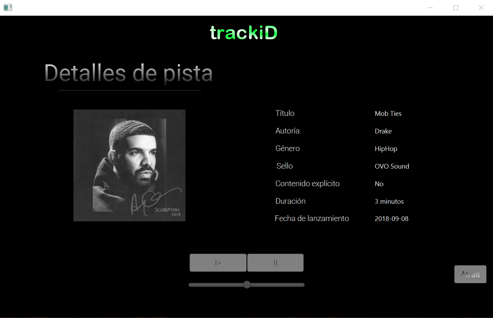
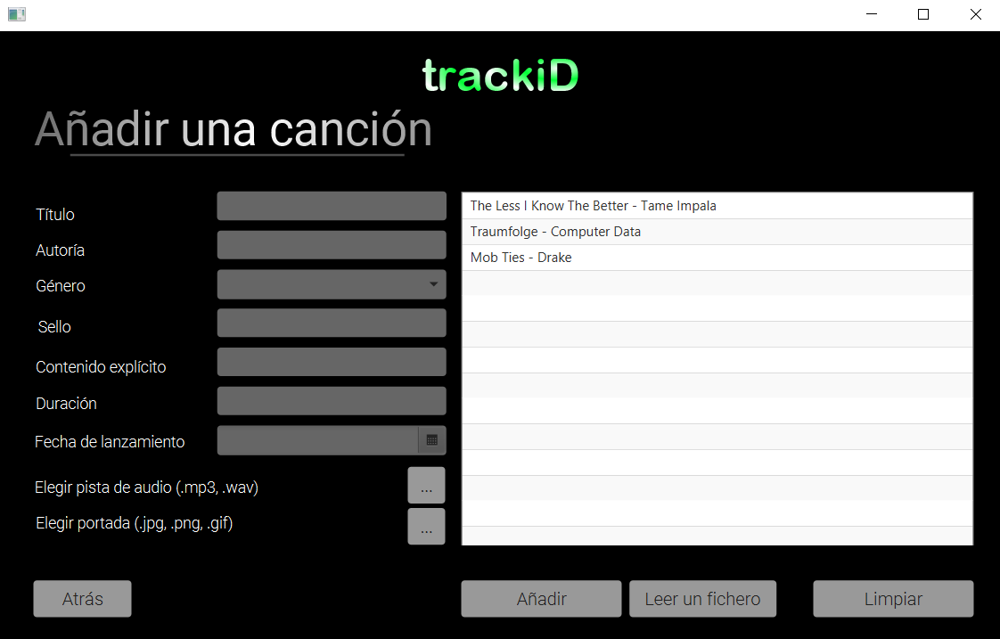
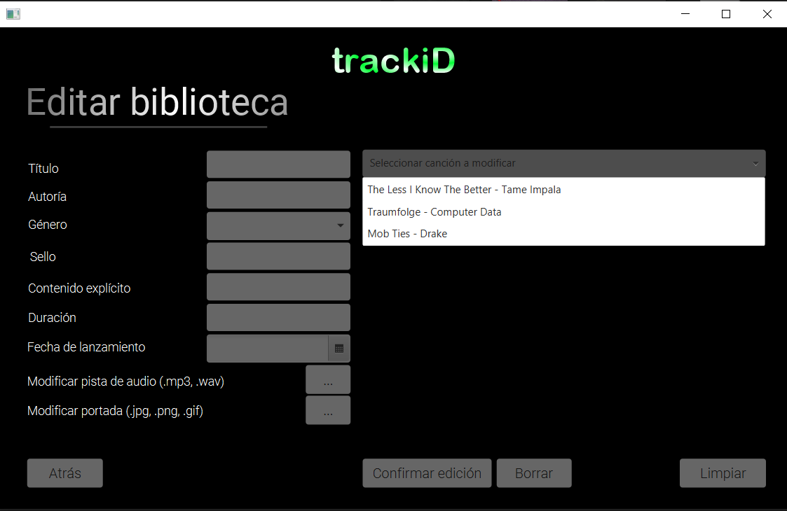

# Contenido del proyecto

## Requisitos mínimos

- Diseño de la aplicación incluyendo diagrama de clases, casos de uso, de 
secuencia y/o estados según aplique :white_check_mark:
- Diseño lógico relacional de la base de datos, siguiendo un esquema 
normalizado :white_check_mark:
- Uso de la herencia de clases y clases abstractas :white_check_mark:
- Uso de la composición/agregación de clases :white_check_mark:
- Uso de procedimientos almacenados/funciones en la base de datos :white_check_mark:
- Conexión JDBC con la base de datos para realizar operaciones de inserción, 
actualización y consulta de datos :white_check_mark:
- Uso de un fichero para leer los datos de conexión a la base de datos :white_check_mark:

## Mejoras

- Interfaz gráfica con JavaFX :white_check_mark:
- Uso de ficheros :white_check_mark:
- Uso de interfaces con métodos para implementar por las clases usadas :x:
- Uso de métodos abstractos, enumerados y expresiones regulares :white_check_mark:
- Documentación de todas las clases y métodos usando javadoc (target/site/apidocs/allclases-index.html) :white_check_mark:
- Inclusión de tests unitarios :white_check_mark:
- Inclusión de listado de pruebas funcionales :white_check_mark:

# About

*trackiD es una aplicación de escritorio que recrea el proceso de distribución de música en las 
diferentes plataformas digitales, ya que para subir contenido a éstas, es necesaria una 
plataforma intermediaria.*

