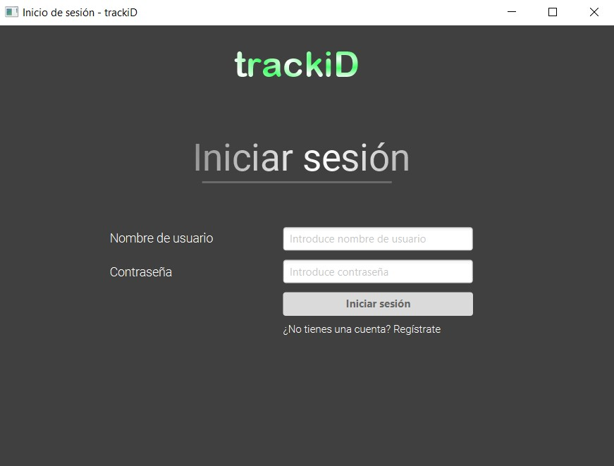
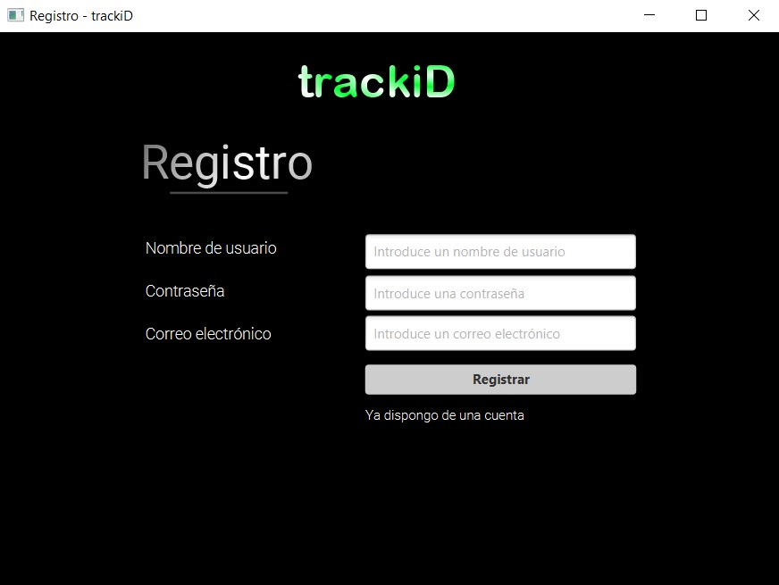
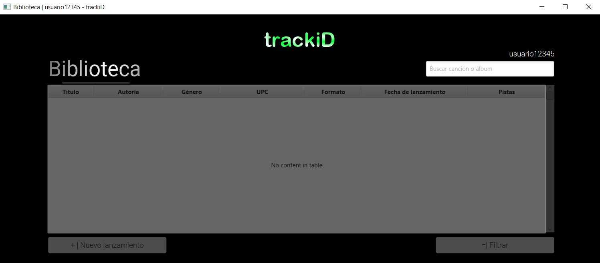
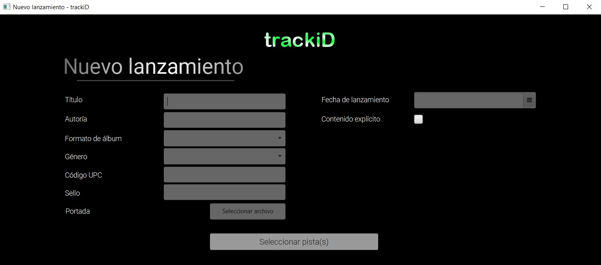
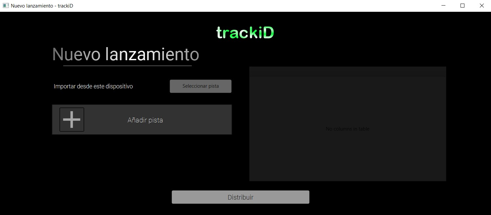

# Interfaz proyecto trackiD [Prototipo]

* * o _ _trackiD es una aplicación de escritorio que recrea el proceso de distribución de música en las 
diferentes plataformas digitales, ya que para subir contenido a éstas, es necesaria una 
plataforma intermediaria.
